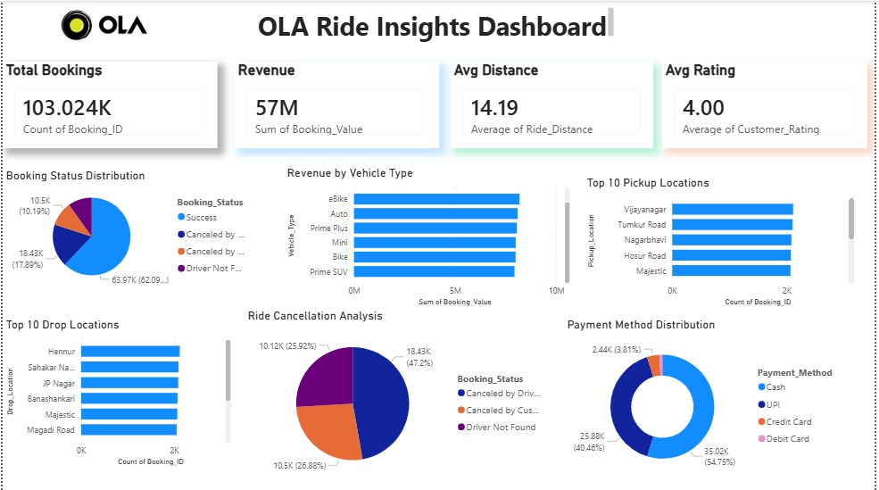

# 🚖 OLA Ride Insights Dashboard

OLA Ride Insights Dashboard built using SQL, Power BI, Python and Streamlit.

## Dashboard Preview

## Project Overview

This project analyzes 103,024+ OLA ride records to generate business insights related to:

- Ride Bookings
- Revenue Analysis
- Vehicle Performance
- Ride Cancellations
- Payment Methods
- Pickup & Drop Locations

## Tools Used

- SQL
- Power BI
- Python
- Streamlit
- Plotly
- Excel

## Key Features

- Interactive Dashboard
- KPI Cards
- Booking Status Analysis
- Revenue by Vehicle Type
- Payment Method Distribution
- Top Pickup Locations
- Top Drop Locations
- Ride Cancellation Analysis

## Files Included

- app.py
- ola.xlsx
- requirements.txt
- OLA_Ride_Insights_SQL.sql
- OLA_Ride_Insights_Dashboard.pbix
- dashboard.png

## Author

Sanjog Ram
